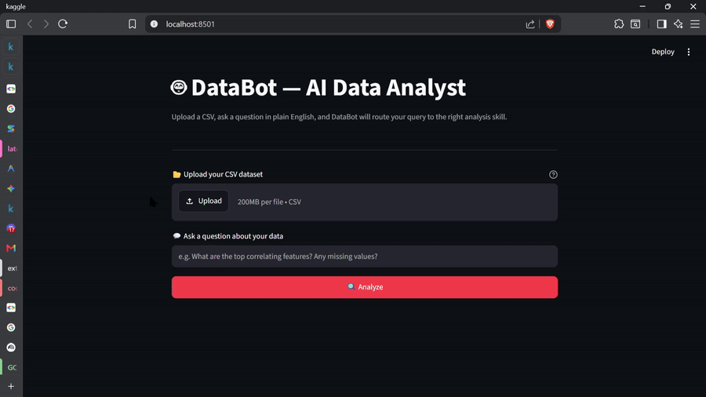

# DataBot

DataBot is an intelligent, extensible, and secure AI data analyst. Powered by the Google Agentic Development Kit (ADK) and Gemini models, DataBot can dynamically route user queries to specialized skills, interact with underlying data analysis tools via the Model Context Protocol (MCP), and enforce strict security constraints during execution.

## Demo





## Run the App
streamlit run app.py

## Features

- **Skill Routing**: Dynamically interprets user queries to load the most relevant context and procedures (e.g., Exploratory Data Analysis, Feature Engineering, Model Training).
- **Model Context Protocol (MCP)**: Utilizes a standard MCP server to expose data processing tools safely and scalably to the agent.
- **Guardrails & Policy Enforcement**: All tool inputs and outputs are validated through robust interceptors. Sensitive operations are verified against a dedicated Policy Server to prevent unauthorized data access or destructive actions.
- **Spec-driven & Automated Evaluations**: Agent behaviors are rigorously tested using BDD (Behavior-Driven Development) specifications and an automated evaluation runner.
- **CI/CD Integration**: Evaluations act as a quality gate via GitHub Actions.

## Architecture

```text
+-------------------+       +-----------------------+       +-------------------+
|                   |       |                       |       |                   |
|   User Query      | ----> |     Skill Router      | ----> |    Agent loaded   |
|                   |       |  (Selects Best Skill) |       |   with Skill Context|
+-------------------+       +-----------------------+       +-------------------+
                                                                     |
                                                                     v
                                                          +-------------------+
                                                          |                   |
                                                          |   MCP Client      |
                                                          |                   |
                                                          +-------------------+
                                                                     |
                                                                     v
+-------------------+       +-----------------------+       +-------------------+
|                   |       |                       |       |                   |
|   Policy Server   | <---- |      Guardrails       | <---- |   MCP Server      |
|  (Auth / Checks)  |       |    (Interceptors)     |       | (Python Tools)    |
|                   |       |                       |       |                   |
+-------------------+       +-----------------------+       +-------------------+
```

## Setup Instructions

### 1. Create a Virtual Environment

It is recommended to use a virtual environment to manage dependencies:

```bash
python -m venv venv
# On Windows (PowerShell):
venv\Scripts\activate
# On macOS/Linux:
source venv/bin/activate
```

### 2. Install Dependencies

Install the required packages (ensure `google-adk`, `google-genai`, `mcp`, `fastapi`, and `uvicorn` are available):

```bash
pip install -r requirements.txt
```

### 3. Set Environment Variables

You must set your Google Gemini API key to interact with the LLM:

```bash
# On Windows (PowerShell):
$env:GOOGLE_API_KEY="your_api_key_here"

# On macOS/Linux:
export GOOGLE_API_KEY="your_api_key_here"
```

## Usage

### Running the DataBot Agent

You can interact with DataBot by passing a dataset and your query to `skill_agent.py`. The agent will automatically select the best skill (e.g., EDA, Feature Engineering, or Model Training) and execute the request securely.

```bash
python skill_agent.py path/to/your_dataset.csv "Give me an overview of this data"
```


## Evaluations and Testing

DataBot uses an automated evaluation framework to ensure the agent behaves correctly against defined BDD specifications.

### Running Evals Locally

You can run the full suite of evaluations locally by executing:

```bash
python evals/eval_runner.py
```

This will run the scenarios defined in the specs and output the success rate and failure details in JSON format to help you benchmark agent reliability.

### Continuous Integration (CI)

This project is configured with GitHub Actions to enforce quality standards. **On every push and pull request**, the CI pipeline automatically triggers the evaluation suite (`eval_runner.py`). If the agent's behavior falls below the required threshold or fails critical tests, the pipeline will fail, acting as a gatekeeper to prevent regressions from reaching production.
